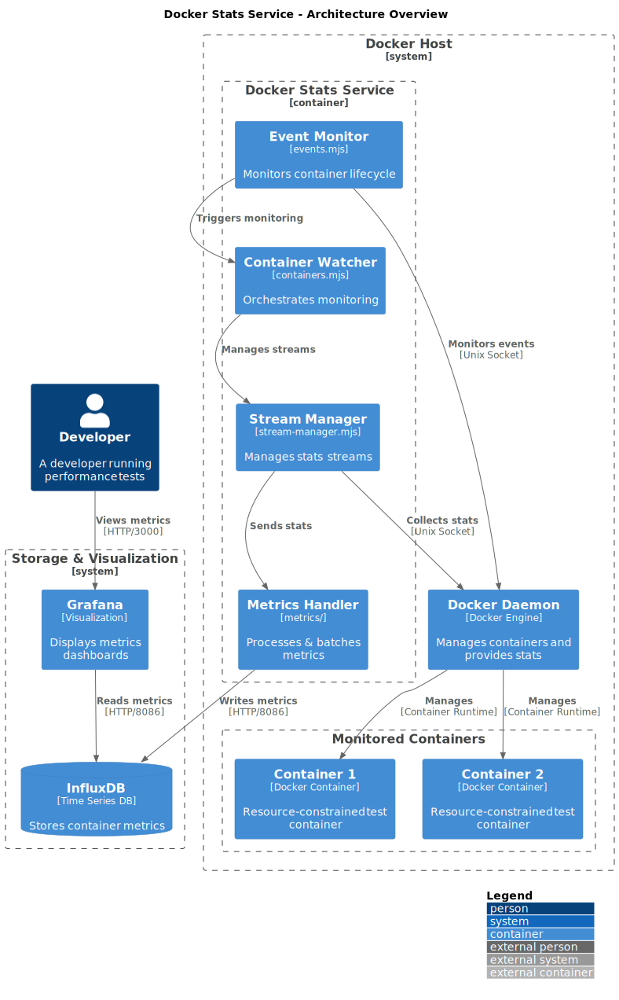

# Docker Stats Service

A lightweight service that collects real-time Docker container metrics and stores them in InfluxDB. It automatically discovers containers, tracks their resource usage, and provides detailed metrics visualization through Grafana.

## Purpose & Use Case

This service is not intended to replace production-grade monitoring solutions like cAdvisor + Prometheus. Instead, it serves as a lightweight alternative specifically designed for development and testing scenarios.

The project emerged from a specific need: performing isolated performance testing of Docker containers with limited resources. While tools like cAdvisor + Prometheus are excellent for production monitoring, they presented limitations for this use case:

- Difficulty in getting precise CPU usage metrics for single containers with resource limits
- Sampling intervals averaging 2–5 seconds, which didn't correlate well with `docker stats` output
- Need for more granular, real-time metrics (~1 s sampling) during load testing

This service fills that gap by providing:

- High-precision resource utilization metrics
- Direct correlation with `docker stats` output
- Simplified setup for development environments
- Focus on single-container detailed metrics

Perfect for:

- Load testing with resource-constrained containers
- Development environment monitoring
- Quick resource utilization analysis
- Scenarios require high-frequency sampling

## Quick Start

```bash
# Clone the repository
git clone https://github.com/JoobyPM/docker-stats-service
cd docker-stats-service

# Start all services using Docker Compose
docker compose -f docker/docker-compose.yml up -d

# Access Grafana dashboard
open http://localhost:3009
# Login with admin/admin
```

## Features

- Real-time container metrics collection
- Automatic container discovery and monitoring
- Pre-configured Grafana dashboards (auto-provisioned from `docker/config/dashboards/`)
- Event-based container monitoring
- Efficient InfluxDB storage
- Configurable logging levels
- Support for both local and Docker environments

## Prerequisites

- Docker 20.10.0 or higher
- Docker Compose v2.0.0 or higher
- Node.js 18+ (for local development)
- pnpm 8.0.0 or higher
- 256MB+ available memory
- Available ports: 3009 (Grafana), 8086 (InfluxDB)

## Metrics Collected

### System Metrics

- CPU Usage
  - Overall CPU percentage utilization
- Memory Usage
  - Used memory (bytes)
  - Total memory limit
- Network Statistics
  - Bytes received (RX)
  - Bytes transmitted (TX)

### Container Events

- Container start events
- Container stop events
- Container kill events

## Environment Variables

| Variable                   | Description                                 | Default        | Required |
| -------------------------- | ------------------------------------------- | -------------- | -------- |
| `DOCKER`                   | Running in Docker environment               | `false`        | No       |
| `LOG_LEVEL`                | Logging verbosity (debug,info,warn,error)   | `info`         | No       |
| `INFLUXDB_HOST`            | InfluxDB host                               | `localhost`    | Yes      |
| `INFLUXDB_PORT`            | InfluxDB port                               | `8086`         | No       |
| `INFLUXDB_PROTOCOL`        | InfluxDB protocol                           | `http`         | No       |
| `INFLUXDB_USER`            | InfluxDB username                           | `admin`        | No       |
| `INFLUXDB_PASS`            | InfluxDB password                           | `admin`        | No       |
| `INFLUXDB_DB`              | InfluxDB database name                      | `docker-stats` | No       |
| `STATS_INTERVAL_MS`        | Stats collection interval in ms             | `1000`         | No       |
| `INFLUXDB_RETRY_MAX`       | Maximum number of retry attempts            | `5`            | No       |
| `INFLUXDB_RETRY_DELAY`     | Initial retry delay in milliseconds         | `1000`         | No       |
| `INFLUXDB_RETRY_MAX_DELAY` | Maximum retry delay in milliseconds         | `10000`        | No       |
| `SHUTDOWN_TIMEOUT_MS`      | Maximum time to wait for graceful shutdown  | `10000`        | No       |
| `BATCH_SIZE`               | Maximum number of points in a metrics batch | `100`          | No       |
| `BATCH_WAIT_MS`            | Maximum time to wait before flushing batch  | `2000`         | No       |

### Metrics Batching

The service implements efficient metrics batching to optimize InfluxDB write performance:

1. **Batching Strategy**

   - Points are collected in memory until batch criteria are met
   - Batches are flushed when either:
     - Batch size reaches `BATCH_SIZE`
     - Time since last flush exceeds `BATCH_WAIT_MS`
     - Service is shutting down

2. **Performance Benefits**

   - Reduced network overhead
   - Fewer database write operations
   - Lower database load
   - Better throughput
   - Optimized resource usage

3. **Reliability Features**

   - Automatic retry on writing failures
   - Failed writes are re-queued
   - Exponential backoff between retries
   - Graceful handling of shutdown
   - Memory usage protection

4. **Batch Processing**

   ```
   [Container Stats] → [Memory Batch] → [InfluxDB Write]
                          ↑               ↓
                    [New Points]    [Success/Retry]
   ```

5. **Best Practices**
   - Adjust batch size based on container count
   - Monitor memory usage
   - Balance latency vs throughput
   - Consider network conditions
   - Monitor write performance

### Error Handling

The service implements comprehensive error handling with the following features:

1. **InfluxDB Operations**

   - Automatic retry for transient failures
   - Smart error classification (fatal vs. retryable)
   - Exponential backoff with jitter
   - Detailed error logging

2. **Fatal Errors** (no retry)

   - Authentication failures
   - Permission issues
   - Invalid database names
   - Database not found

3. **Retryable Errors** (with backoff)

   - Network timeouts
   - Connection refused
   - Socket hang ups
   - Connection resets

4. **Stream Handling**
   - Automatic cleanup of dead streams
   - Error recovery for Docker stats streams
   - JSON parsing error handling
   - Network error recovery

### Graceful Shutdown

The service implements a robust graceful shutdown mechanism that ensures:

1. **Clean Resource Release**

   - Proper closure of Docker stats streams
   - Graceful InfluxDB connection termination
   - Event stream cleanup

2. **Shutdown Triggers**

   - SIGTERM signal handling
   - SIGINT (Ctrl+C) handling
   - Uncaught exception handling
   - Unhandled rejection handling

3. **Shutdown Process**

   - Stop accepting new container watches
   - Completes in-flight metric writes
   - Closes active connections
   - Logs shutdown progress

4. **Timeout Protection**
   - Maximum shutdown wait time
   - Force exit if timeout exceeded
   - Individual handler timeouts

### Retry Mechanism

The service implements a robust retry mechanism for InfluxDB operations with the following features:

- Exponential backoff with jitter
- Configurable retry attempts and delays
- Smart error handling (no retries for authentication failures)
- Automatic retry for transient network issues
- Detailed logging of retry attempts

The retry mechanism applies to:

- Database initialization
- Metrics writing
- Connection health checks
- Database operations

## Health Checks

The service implements the following health checks:

1. Docker API connectivity
2. InfluxDB connection status
3. Metrics write capability
4. Event stream status

## Data Structure

### InfluxDB Schema

```
measurement: docker_stats
tags:
  - container_id: unique container identifier
  - container_name: human-readable container name
fields:
  - cpu_percent: CPU usage percentage
  - mem_used: Memory usage in bytes
  - mem_total: Total memory limit
  - net_in_bytes: Network bytes received
  - net_out_bytes: Network bytes transmitted
timestamp: measurement timestamp
```

### Grafana Dashboards

The service comes with pre-configured Grafana dashboards that are automatically provisioned during startup. The dashboards are stored in:

```
docker/config/dashboards/
```

To customize or add new dashboards:

1. Add your JSON dashboard files to the `docker/config/dashboards/` directory
2. Restart the Grafana container: `pnpm docker:restart grafana`

The default dashboard provides:

- CPU usage per container
- Memory usage per container
- Network I/O metrics
- Container lifecycle events

## Development

### Local Setup

```bash
# Install dependencies
pnpm install

# Run the service
pnpm start

# Run with debug logging
LOG_LEVEL=debug pnpm start

# Lint code
pnpm lint
pnpm lint:fix  # Auto-fix linting issues

# Format code
pnpm format
pnpm format:check  # Check formatting without fixing
```

### Docker Commands

```bash
# Start all services
pnpm docker:up

# Force rebuild and start
pnpm docker:up:force

# View logs
pnpm docker:logs

# Stop services
pnpm docker:down

# Build containers
pnpm docker:build

# Restart services
pnpm docker:restart

# Stop services (without removing)
pnpm docker:stop
```

## Troubleshooting

### Common Issues

1. **No Metrics Appearing**

   - Check Docker socket permissions: `ls -la /var/run/docker.sock`
   - Verify InfluxDB connection: `curl http://localhost:8086/health`
   - Check container logs: `docker logs docker-stats-service`

2. **High CPU Usage**

   - Reduce logging level: `LOG_LEVEL=warn`
   - Increase stats interval: `STATS_INTERVAL_MS=5000`
   - Check container count: `docker ps | wc -l`
   - Monitor InfluxDB write performance

3. **Memory Issues**

   - Check available system memory: `free -m` (for linux users)
   - Monitor container memory limits
   - Verify InfluxDB memory usage
   - Consider enabling swap

4. **Network Connectivity**
   - Verify Docker network: `docker network ls`
   - Verify port mappings: `docker compose -f docker/docker-compose.yml ps`
   - Check network driver status

### Debug Mode

Enable debug logging for detailed information:

```bash
LOG_LEVEL=debug pnpm start
```

## Contributing

1. Fork the repository
2. Create your feature branch: `git checkout -b feature/amazing-feature`
3. Commit your changes: `git commit -m 'Add amazing feature'`
4. Push to the branch: `git push origin feature/amazing-feature`
5. Open a Pull Request

### Development Guidelines

- Follow ESLint configuration
- Add tests for new features
- Update documentation
- Follow semantic versioning
- Add meaningful commit messages
- Follow negative space programming concept, you can read why [Exploring the Power of Negative Space Programming](https://double-trouble.dev/post/negativ-space-programming/)

## Architecture

The service follows a modular architecture designed for reliability and performance. Below are the key architectural diagrams:

### System Overview



The system consists of three main parts:

1. Docker Host - Where containers run and metrics are collected
2. Storage & Visualization - Where metrics are stored and displayed
3. User Interface - Where metrics are viewed and analyzed

### Component Architecture

[Component Architecture](docs/architecture/components.puml)

Key components:

1. **Event Monitor** - Watches Docker events for container lifecycle changes
2. **Stats Collector** - Collects and processes container metrics
3. **Metrics Batcher** - Batches metrics for efficient storage
4. **Retry Handler** - Manages retries for failed operations
5. **Shutdown Manager** - Ensures graceful service shutdown
6. **Utilities** - Error handling and logging components

### Metrics Collection Flow

[Metrics Flow](docs/architecture/metrics_flow.puml)

The metrics collection process:

1. Container start triggers stats collection
2. Metrics are collected at configured intervals
3. Points are batched for efficient writing
4. Batches are written with retry support
5. Container stop ends collection
6. Shutdown ensures no data loss

## License

[MIT License](https://opensource.org/licenses/MIT)

See the [LICENSE](./LICENSE.md) file for details.

## Acknowledgments

- Docker Engine API
- InfluxDB Team
- Grafana Labs
- dockerode

## Documentation

### Guides

The following guides are available in the [docs/guides](docs/guides) directory:

- [Testing Guide](docs/guides/testing.md) - Detailed information about testing practices and procedures
- [Docker Container Stats Explained](docs/guides/docker-stats-and-dockerode-guide.md) - Small Guide to Dockerode & Docker Stats

### JSDoc Documentation

The codebase is thoroughly documented using JSDoc comments. This provides:

- Type definitions for key interfaces and configurations
- Detailed function documentation with parameters and return types
- Usage examples for major utilities
- Clear documentation of error handling and edge cases

To generate documentation from JSDoc comments:

1. Generate documentation:

```bash
pnpm run jsdoc
```

The generated documentation will be available in the `docs/api` directory.

### Architecture Diagrams

The `docs/architecture` directory contains PlantUML diagrams that visualize:

- High-level system architecture (`overview.puml`)
- Internal component structure (`components.puml`)
- Metrics collection flow (`metrics_flow.puml`)

## Docker Socket & Permissions

This service requires access to the Docker socket (`/var/run/docker.sock`) to collect container statistics. Common permission issues can prevent the service from reading container stats.

### Socket Configuration

1. The socket must be mounted in your container:

   ```yaml
   volumes:
     - /var/run/docker.sock:/var/run/docker.sock
   ```

2. Ensure proper socket permissions on the host:

   ```bash
   # Check current permissions
   ls -l /var/run/docker.sock

   # Fix permissions if needed (common solution)
   sudo chmod 666 /var/run/docker.sock
   ```

3. Group membership (alternative to chmod):
   ```bash
   # Add your user to the docker group
   sudo usermod -aG docker $USER
   ```

### Common Permission Issues

- **No stats showing up**: First check if the service can access the Docker socket
- **Permission denied errors**: Verify socket permissions and group membership
- **Socket not found**: Ensure Docker is running and the socket is mounted correctly

## Documentation

### JSDoc Documentation

The codebase is extensively documented using JSDoc comments. This includes:

- Negative-space programming checks
- Retry mechanisms and error handling
- Configuration options and environment variables
- Type definitions and interfaces

Generate the documentation:

```bash
pnpm run jsdoc
```

The generated documentation will be available in the `docs` directory.

### Documentation Maintenance

When modifying the codebase:

1. Keep JSDoc comments up to date with code changes
2. Update type definitions if interfaces change
3. Ensure `jsdoc.config.json` references remain valid if files are moved
4. Run `pnpm run jsdoc` to verify documentation builds correctly
