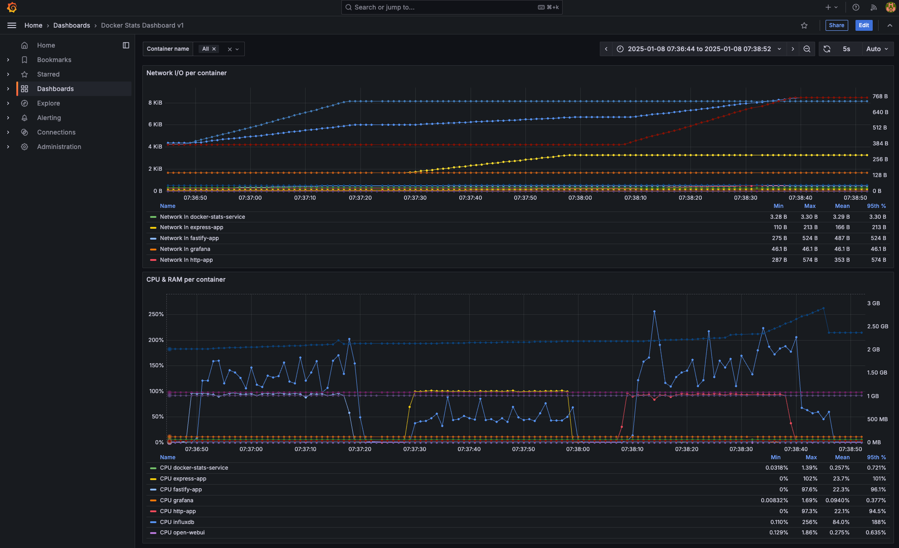

# Docker Stats Service

A lightweight service for real-time Docker container metrics collection and storage in InfluxDB, optimized for development and testing environments.

## Key Features

- **Real-Time Monitoring**

  - Continuous streaming of container stats via Docker's native API
  - Automatic container discovery and monitoring
  - Stream-based collection with automatic recovery
  - Memory-efficient stream management

- **Robust Data Processing**

  - Efficient metrics batching and buffering
  - Automatic retry mechanisms for resilience
  - Comprehensive error handling
  - Smart backpressure handling

- **Flexible Configuration**

  - Environment-based configuration
  - Configurable metrics collection (all, essential, or custom fields)
  - Adjustable batch sizes and intervals
  - Fine-tuned retry policies

- **Easy Integration**
  - Docker Compose deployment support
  - Native Docker socket integration via Dockerode
  - InfluxDB 1.X integration for metrics storage
  - Pre-configured Grafana dashboards

[📚 Read the full documentation](docs/index.md)

### Example Dashboard



## Quick Start

```bash
# Clone and enter the repository
git clone https://github.com/JoobyPM/docker-stats-service
cd docker-stats-service

# Start all services (collects all metrics by default)
docker compose -f docker/docker-compose.yml up -d

# Or start with essential metrics only (CPU, memory, network)
STATS_FIELDS=ESSENTIAL docker compose -f docker/docker-compose.yml up -d

# Or start with custom metrics selection
STATS_FIELDS=cpu_percent,mem_used,blkio_read_bytes docker compose -f docker/docker-compose.yml up -d

# Access Grafana dashboard
open http://localhost:3009  # Login with admin/admin
```

## Prerequisites

- Docker 20.10.0+
- Docker Compose v2.0.0+
- Available ports: 3009 (Grafana), 8086 (InfluxDB)

For local development:

- Node.js 21+
- pnpm 8.0.0+

## Basic Usage

1. **View Metrics**

   - Access Grafana at `http://localhost:3009`
   - Use the pre-configured dashboards
   - Monitor container CPU, memory, and network stats

2. **Custom Dashboards**

   - Add dashboards to `docker/grafana_config/dashboards/`
   - Restart Grafana: `pnpm docker:restart grafana`

3. **Development Mode**

   ```bash
   # Local development with all metrics
   pnpm install
   pnpm start

   # With essential metrics only (CPU, memory, network)
   STATS_FIELDS=ESSENTIAL pnpm start

   # With custom metrics selection
   STATS_FIELDS=cpu_percent,mem_used,pids_current pnpm start

   # Example: Network-focused monitoring
   STATS_FIELDS=net_in_bytes,net_out_bytes,net_eth0_in_packets pnpm start

   # Example: Memory analysis
   STATS_FIELDS=mem_used,mem_cache,mem_active_anon,mem_pgfault pnpm start

   # With debug logging
   LOG_LEVEL=debug pnpm start

   # Enable specific debug patterns
   DEBUG=docker-stats:stream,docker-stats:events pnpm start
   ```

4. **Troubleshooting**

   ```bash
   # Check service status
   docker compose -f docker/docker-compose.yml ps

   # View detailed logs
   docker compose -f docker/docker-compose.yml logs -f docker-stats

   # Monitor resource usage
   docker stats docker-stats-service
   ```

5. **Advanced Configuration**

   ```bash
   # Optimize for high throughput
   export BATCH_SIZE=200
   export BATCH_WAIT_MS=5000

   # Enable automatic recovery
   export INFLUXDB_RETRY_MAX=10
   export INFLUXDB_RETRY_DELAY=2000

   # Select specific metrics to collect
   export STATS_FIELDS=cpu_percent,mem_used,blkio_read_bytes

   pnpm start
   ```

## Documentation

- [Getting Started Guide](docs/getting-started.md)
- [Configuration Guide](docs/configuration.md)
- [Architecture Overview](docs/architecture/README.md)
- [Troubleshooting Guide](docs/troubleshooting.md)

## Contributing

1. Fork the repository
2. Create your feature branch: `git checkout -b feature/amazing-feature`
3. Commit your changes: `git commit -m 'Add amazing feature'`
4. Push to the branch: `git push origin feature/amazing-feature`
5. Open a Pull Request

See our [Contributing Guide](docs/guides/index.md) for detailed guidelines.

## License

[MIT License](LICENSE.md)

## Acknowledgments

- Docker Engine API
- InfluxDB Team
- Grafana Labs
- dockerode
